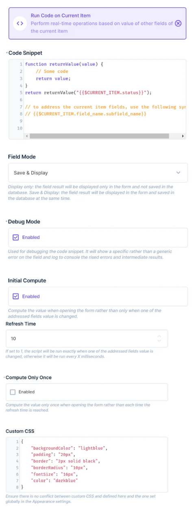
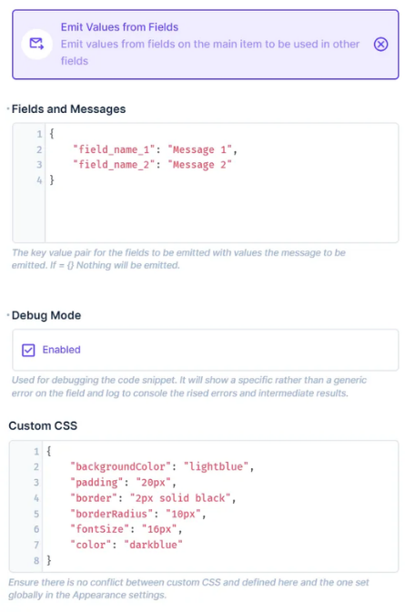
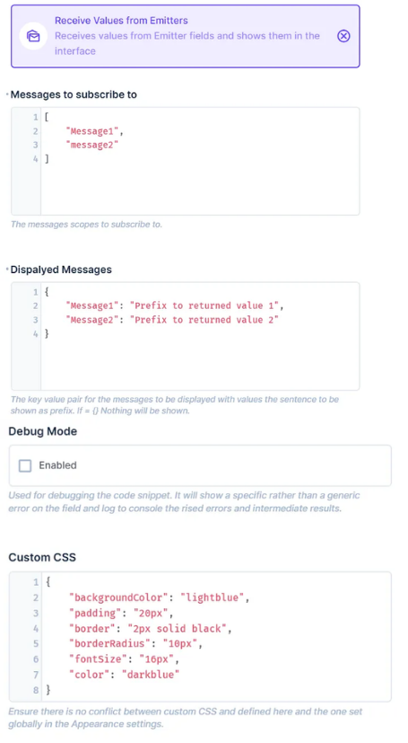
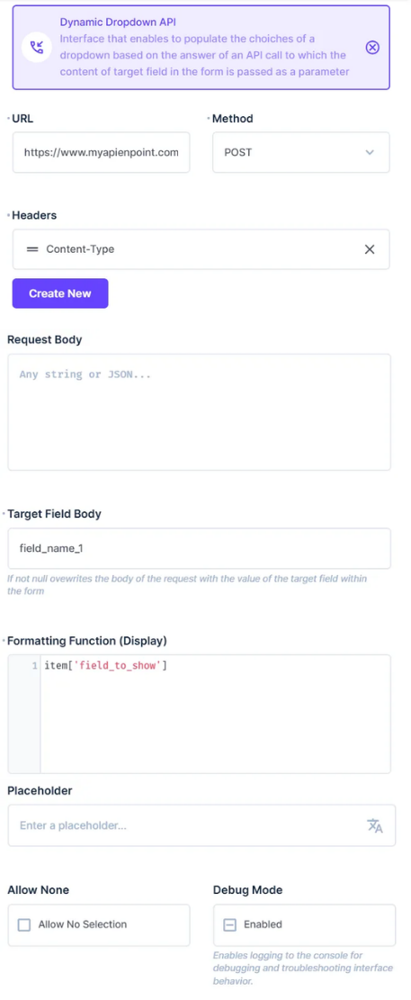

# Custom Directus Interface Extensions

This repository contains three custom Directus interface extensions that enable dynamic script execution, inter-component communication, and API-powered dropdowns. Building on top of work carried out in https://github.com/rezo-labs/directus-extension-computed-interface

## 1. Dynamic Script Runner

The **`directus-extension-dynamic-script-runner`** allows for executing JavaScript code defined as a function within the custom interface's configuration. This extension supports API calls, managed through a sandboxed **Directus router** object, ensuring controlled interactions with external or internal data sources.

### Features:
- Execute custom JavaScript functions within Directus interfaces.
- Make API calls via the Directus router.
- Monitor changes in referenced fields using a watcher.
- Regulated updates with a debouncer based on the **"refresh time"** setting.



---

## 2. Emitter-Receiver Event Bus

The **`directus-extension-emitter-receiver-bus`** interface consists of an **emitter** and a **receiver**, which communicate through a shared **eventBus** with memory. This allows data persistence between different mounting phases, ensuring that the emitter and receiver can exchange messages even when not active simultaneously.

### Features:
- Define which field values should be sent with specific messages in the emitter.
- Specify which messages to subscribe to in the receiver.
- Enables communication between elements that are not directly connected in the DOM (e.g., a **parent item** and a **repeater object** inside it).
- Uses an event-based system to exchange data across independent components.
- Updates follow a **fixed 500ms debouncing time**.




---

## 3. Dynamic API Dropdown

The **`directus-extension-dynamic-api-dropdown`** is a searchable dropdown that populates its options with values retrieved from an API call. Users can define a **custom request body** in the admin interface configuration or override it with a value from a field within the item.

### Features:
- Fetch dropdown options from an API response.
- Define a custom request body in the interface configuration.
- Merge the request body with values from a field in the item.
- Apply a **custom transformation function** to modify how items appear in the dropdown and input field.
- Users see only the transformed values, while the emitted and saved value remains the original API response.



---

## Installation & Usage

1. Clone this repository.
2. Install the extension(s) into your Directus project.
3. Configure each extension in the Directus admin panel.

```bash
# Example installation command
npm install directus-extension-dynamic-script-runner directus-extension-emitter-receiver-bus directus-extension-dynamic-api-dropdown
